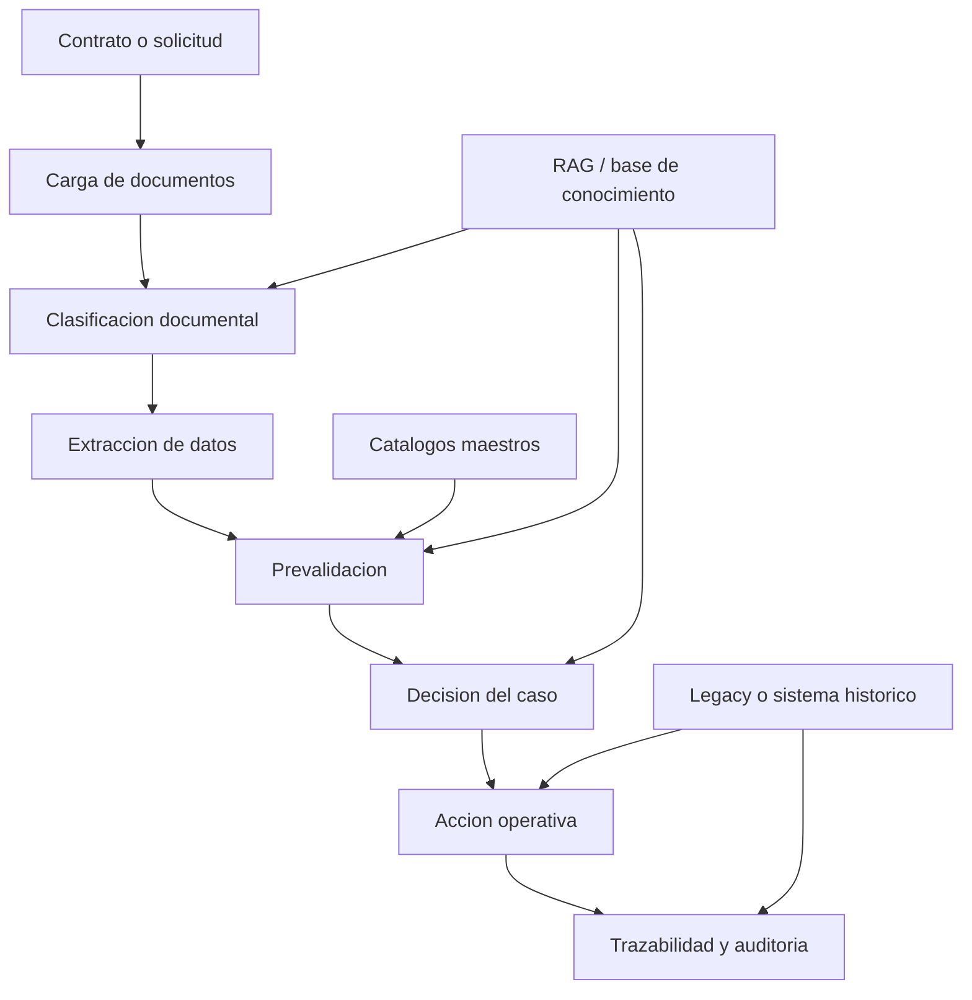

# Arquitectura simple de operacion para sistemas de afiliacion ARL

## Proposito

Este documento explica la logica limpia del sistema Imagine Afiliaciones para que otro sistema de afiliaciones ARL pueda entenderla y adoptarla sin copiar pantallas, nombres internos o reglas que no le corresponden.

La idea central es ordenar el sistema por responsabilidades. Un sistema de afiliacion no debe ser una mezcla de carga, OCR, validacion, decision, plano y auditoria en una sola pantalla o una sola funcion. Debe comportarse como una cadena clara donde cada modulo hace una parte y deja evidencia para el siguiente.

## Diagrama conceptual



## Flujo limpio

```text
CONTRATO
   ↓
CARGA DE DOCUMENTOS
   ↓
CLASIFICACION DOCUMENTAL
   ↓
EXTRACCION DE DATOS
   ↓
PREVALIDACION
   ↓
DECISION
   ↓
ACCION OPERATIVA
   ↓
TRAZABILIDAD
```

La regla conceptual es:

```text
Los documentos alimentan datos.
Los datos alimentan reglas.
Las reglas producen hallazgos.
Los hallazgos producen una decision.
La decision habilita acciones.
Las acciones dejan trazabilidad.
```

## Responsabilidad de cada modulo

### 1. Contrato o solicitud

Es la unidad de control del sistema.

Todo caso debe tener un identificador operativo: numero de contrato, numero de solicitud, lote o el identificador que defina el negocio.

Ese identificador debe estar presente en bandejas, reportes, mensajes de error, auditoria y salida final.

### 2. Carga de documentos

Recibe archivos. No debe decidir el resultado del caso.

Su responsabilidad es:

- Registrar el caso.
- Guardar los archivos.
- Asociar los archivos al identificador del caso.
- Validar condiciones minimas de recepcion.

La carga no debe aprobar ni rechazar un contrato por reglas profundas de negocio. Para eso existe la prevalidacion.

### 3. Clasificacion documental

Responde una pregunta simple: que es cada archivo?

Ejemplos:

- Excel de afiliacion.
- Formulario.
- Camara de comercio.
- Anexo de sedes.
- Entrega de documentos.
- Otro soporte.

La clasificacion no debe decidir si el contrato es aprobable. Solo organiza la evidencia.

### 4. Extraccion de datos

Lee informacion desde Excel, PDF, OCR o texto.

Ejemplos:

- Numero de contrato.
- NIT.
- Razon social.
- Trabajadores.
- Documentos de identidad.
- Salarios.
- EPS, AFP y ARL.
- Centros de trabajo.
- Actividad economica.
- Ciudad o localidad.

La extraccion no debe corregir silenciosamente datos criticos. Si encuentra caracteres no numericos, diferencias de razon social o datos ambiguos, debe conservar evidencia para que la validacion los revise.

### 5. Prevalidacion

Es el punto donde el sistema compara fuentes y aplica reglas.

Aqui se decide si un hallazgo es:

- Bloqueante.
- Advertencia.
- Informativo.
- Excepcionable.

La prevalidacion debe responder:

- Que regla se evaluo?
- Contra que fuente se comparo?
- Que valor se esperaba?
- Que valor se encontro?
- Que severidad tiene?
- Que debe hacer el operador?

### 6. Decision del caso

Convierte los hallazgos en un estado operativo.

Estados recomendados:

- Aprobable.
- Observado.
- Rechazado.
- En revision.
- Procesado.

La decision debe nacer del backend o motor de reglas, no de la pantalla. La pantalla debe mostrar la decision, no inventarla.

### 7. Accion operativa

Solo ocurre despues de la decision.

Ejemplos:

- Generar plano.
- Enviar a revision.
- Marcar observado.
- Cerrar rechazado.
- Reprocesar con excepcion manual.
- Comparar contra legacy.

Un plano no debe corregir errores que debieron detectarse antes. Si el plano necesita una regla, esa regla debe existir tambien como validacion.

### 8. Trazabilidad y auditoria

Todo lo importante debe quedar registrado.

Debe poder explicarse:

- Que archivos llegaron.
- Que datos se extrajeron.
- Que reglas se ejecutaron.
- Que bloqueantes aparecieron.
- Que operador intervino.
- Que excepcion se acepto.
- Que salida se genero.

La trazabilidad es lo que permite confiar en el sistema.

## Reglas de diseno para mantener el sistema simple

### Una responsabilidad por modulo

Cada modulo debe tener una funcion clara.

Si una misma parte del sistema carga documentos, interpreta OCR, valida reglas, decide estados y genera plano, el sistema se vuelve dificil de mantener.

### El contrato manda el flujo

Todo debe poder verse desde el contrato o identificador principal.

Un operador no deberia buscar por nombre de archivo para entender que paso. Debe poder entrar al contrato y ver todo el historial.

### Las validaciones deben tener estructura

Cada validacion deberia tener:

- Codigo.
- Nombre.
- Fuente.
- Mensaje.
- Severidad.
- Evidencia.
- Accion esperada.
- Indicador de si permite excepcion.

Esto permite que el sistema explique sus decisiones.

### El RAG informa, no aprueba

El RAG es una base de conocimiento. Sirve para consultar normativa, reglas, glosarios, documentos y criterios.

Pero no debe ser la autoridad final para aprobar un contrato.

Las validaciones criticas deben ser reglas auditables, no respuestas probabilisticas.

### El frontend muestra, el backend decide

La pantalla debe ser clara y util para el operador, pero la decision del caso debe venir del backend.

Esto evita que dos pantallas muestren estados diferentes o que una actualizacion visual cambie el comportamiento real.

### Las excepciones son por contrato

Cuando el sistema detecta un falso positivo, el operador puede aceptarlo para ese contrato especifico.

Esa excepcion:

- No cambia la regla general.
- No aplica a otros contratos.
- Debe tener justificacion.
- Debe quedar auditada.
- Debe permitir reproceso.

### El legacy es referencia, no carcel

Si existe un sistema historico, debe usarse para comparar resultados y evitar romper la operacion.

Pero el nuevo sistema tambien debe poder mejorar errores del legacy cuando negocio confirme que el comportamiento anterior era incorrecto.

## Como explicar esto al otro sistema

El mensaje principal para el otro sistema es:

```text
No intenten construir una pantalla que lo haga todo.
Construyan una cadena de responsabilidades.
Cada etapa recibe evidencia, produce resultado y deja trazabilidad.
```

Y tambien:

```text
Un caso debe poder explicar:
que recibio,
que entendio,
que comparo,
que encontro,
que decidio,
quien intervino
y que produjo.
```

## Comparacion entre sistema confuso y sistema limpio

| Sistema confuso | Sistema limpio |
| --- | --- |
| Mezcla carga, OCR, validacion y decision | Separa carga, clasificacion, extraccion, validacion y decision |
| El operador no sabe de donde sale el error | Cada error tiene fuente y evidencia |
| La pantalla define estados | El backend define estados y la pantalla los muestra |
| El RAG decide reglas criticas | El RAG consulta conocimiento y las reglas criticas son auditables |
| El plano corrige datos al final | La prevalidacion detecta errores antes del plano |
| Las excepciones cambian reglas generales | Las excepciones aplican solo por contrato |
| El legacy se copia sin criterio | El legacy se compara y se mejora con aprobacion de negocio |

## Modelo minimo recomendado para otro sistema

Para que el otro sistema sea entendible, deberia tener como minimo estos modulos:

1. Gestor de casos.
2. Cargador de documentos.
3. Clasificador documental.
4. Extractor de datos.
5. Motor de prevalidacion.
6. Gestor de decisiones.
7. Gestor de excepciones.
8. Generador de salida operativa.
9. Auditoria.
10. RAG o base de conocimiento.

## Ejemplo de lectura de un caso

Un operador deberia poder entrar a un contrato y leer algo asi:

```text
Contrato: 1211387
Empresa: Soluciones en Administracion de Riesgos SAS
NIT: 900000000

Documentos recibidos:
- Excel de afiliacion
- Formulario
- Camara de comercio
- Entrega de documentos

Datos extraidos:
- Contrato desde Excel: 1211387
- Contrato desde soporte: 1211387
- Razon social desde Excel: X
- Razon social desde Camara: Y

Prevalidacion:
- NIT coincide: OK
- Contrato coincide: OK
- Razon social difiere formalmente: Bloqueante

Decision:
- Observado

Accion esperada:
- Revisar diferencia de razon social o corregir soporte.
```

Ese nivel de explicacion es lo que hace que el sistema sea entendible.

## Criterio final

Un sistema de afiliaciones ARL no debe ser solamente una herramienta para cargar archivos. Debe ser un sistema que entienda casos, compare evidencias, aplique reglas, permita intervencion humana controlada y deje trazabilidad.

La limpieza del sistema no depende de tener menos funciones. Depende de que cada funcion tenga un lugar claro dentro del flujo.

