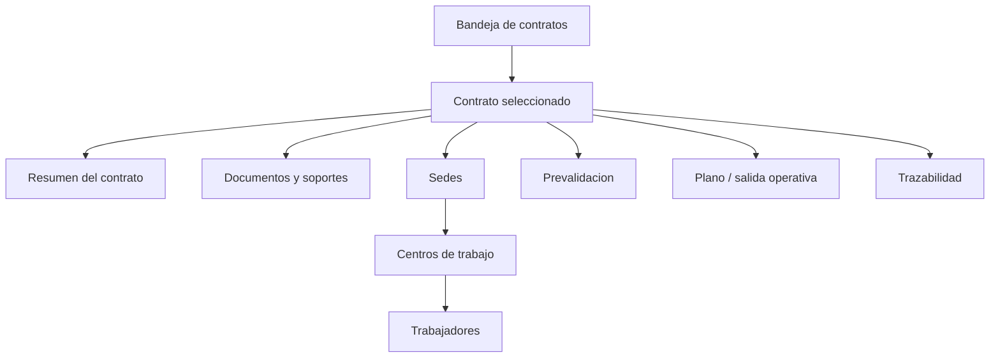

# Patron de pantalla jerarquica por contrato

## Proposito

Este documento explica la forma recomendada de presentar contratos en un sistema de afiliaciones ARL: primero una vista resumida de contratos y luego, al entrar a un contrato, una vista jerarquica con sus ramificaciones.

La idea es que otro sistema pueda copiar la logica de navegacion sin copiar exactamente la pantalla.

## Nombre del patron

Este patron se puede explicar como:

```text
Vista maestro-detalle con navegacion jerarquica por contrato.
```

Tambien puede llamarse:

```text
Bandeja de contratos con detalle progresivo.
```

## Logica general

El operador no debe ver toda la informacion al mismo tiempo. Primero debe ver una lista clara de contratos y su estado. Luego, si necesita investigar, entra a un contrato y ve su estructura interna.

```text
Bandeja de contratos
   ↓ clic en un contrato
Detalle del contrato
   ↓
Sedes
   ↓
Centros de trabajo
   ↓
Trabajadores
   ↓
Validaciones, soportes y acciones
```

## Diagrama conceptual



## Primer nivel: bandeja de contratos

La primera pantalla debe mostrar contratos, no detalles profundos.

Campos recomendados:

- Numero de contrato.
- Empresa.
- NIT.
- Estado.
- Fecha de carga.
- Numero de bloqueantes.
- Numero de trabajadores.
- Accion siguiente.

Ejemplo:

| Contrato | Empresa | NIT | Estado | Bloqueantes | Trabajadores | Accion |
| --- | --- | --- | --- | --- | --- | --- |
| 1211387 | Soluciones en Administracion de Riesgos SAS | 900000000 | Observado | 1 | 24 | Revisar |
| 1211331 | Revoques y Estructuras SAS | 901268914 | Aprobable | 0 | 78 | Generar plano |

Objetivo de esta pantalla:

- Priorizar trabajo.
- Identificar que contratos estan aprobables, observados o rechazados.
- Evitar que el operador tenga que abrir documentos para saber que sigue.

## Segundo nivel: detalle del contrato

Cuando el operador hace clic en un contrato, el sistema debe abrir una vista centrada solo en ese contrato.

En la parte superior debe mantenerse fijo el contexto:

- Contrato.
- Empresa.
- NIT.
- Estado.
- Decision recomendada.
- Cantidad de bloqueantes.
- Acciones principales.

Esto evita que el operador se pierda al bajar al detalle.

## Tercer nivel: estructura interna

Dentro del contrato, la informacion debe organizarse como una estructura de ramas:

```text
Contrato
  ├─ Resumen
  ├─ Documentos
  ├─ Sedes
  │   ├─ Centro de trabajo 1
  │   │   ├─ Trabajador 1
  │   │   ├─ Trabajador 2
  │   │   └─ Trabajador 3
  │   └─ Centro de trabajo 2
  │       ├─ Trabajador 4
  │       └─ Trabajador 5
  ├─ Prevalidacion
  ├─ Plano
  └─ Auditoria
```

La pantalla no debe mostrar todo expandido desde el inicio. Debe permitir abrir y cerrar secciones.

## Por que sedes, centros y trabajadores

En afiliaciones ARL, un trabajador no esta aislado. Normalmente depende de:

- Empresa.
- Contrato.
- Sede.
- Centro de trabajo.
- Actividad economica.
- Clase de riesgo.
- Tarifa.

Por eso la pantalla debe mostrar la relacion:

```text
Contrato → Sede → Centro de trabajo → Trabajador
```

Esta estructura ayuda a detectar errores como:

- Trabajador asociado a sede incorrecta.
- Centro de trabajo con actividad economica equivocada.
- Varios centros mostrando el mismo nombre.
- Ciudad o localidad tomada de una fuente incorrecta.
- Riesgo del trabajador calculado desde una sede equivocada.

## Regla visual principal

Mostrar primero el resumen y despues el detalle.

```text
No mostrar 500 datos al operador de entrada.
Mostrarle primero:
que contrato es,
en que estado esta,
que problema tiene,
y donde debe hacer clic.
```

## Como debe comportarse el clic

Al hacer clic sobre un contrato:

1. Se abre el detalle del contrato.
2. El encabezado mantiene el contrato visible.
3. Se muestran secciones ordenadas.
4. Las sedes se muestran como grupos.
5. Dentro de cada sede aparecen sus centros de trabajo.
6. Dentro de cada centro aparecen sus trabajadores.
7. Los errores se muestran cerca del nivel donde ocurren.

Ejemplo:

```text
Contrato 1211387
Estado: Observado

Sede principal
  Centro de trabajo: Bogota
    Trabajadores: 12
    Validaciones: OK

Sede secundaria
  Centro de trabajo: Medellin
    Trabajadores: 8
    Validaciones:
      - Actividad economica no coincide
```

## Donde mostrar los errores

Los errores deben aparecer en dos niveles:

### Resumen del contrato

Para que el operador sepa rapidamente si el caso esta bloqueado.

Ejemplo:

```text
Bloqueantes detectados: 2
- Razon social diferente entre Excel y Camara.
- Actividad economica del centro de trabajo 2 no coincide.
```

### Nivel especifico

Para que el operador vea donde esta el problema.

Ejemplo:

```text
Sede: Norte
Centro de trabajo: CT-002
Error: actividad economica no coincide con la fuente esperada.
```

## Principios para copiar este modelo

- La bandeja muestra contratos, no trabajadores sueltos.
- El contrato es el punto de entrada al detalle.
- El detalle mantiene siempre visible el contexto del contrato.
- La informacion se despliega por niveles.
- Los errores deben mostrarse cerca de la fuente del problema.
- Las acciones deben estar ligadas al estado del contrato.
- El operador debe poder volver facil a la bandeja.

## Que no debe hacer el otro sistema

- No mezclar todos los trabajadores de todos los contratos en una sola vista sin contexto.
- No obligar al operador a abrir PDFs para entender el estado.
- No mostrar sedes, centros y trabajadores como listas independientes sin relacion.
- No esconder los bloqueantes en una pantalla tecnica.
- No permitir que la pantalla cambie estados sin decision del backend.
- No generar plano desde una vista donde no se ve la prevalidacion.

## Forma simple de explicarlo al otro equipo

```text
La pantalla debe funcionar como un arbol.

Primero veo el bosque: todos los contratos y sus estados.
Luego entro a un contrato.
Dentro del contrato veo sus ramas:
documentos, sedes, centros, trabajadores, validaciones y acciones.

El operador no debe perseguir la informacion.
La informacion debe estar organizada alrededor del contrato.
```

## Modelo minimo de pantalla

```text
[Bandeja de contratos]
  - Contrato
  - Empresa
  - Estado
  - Bloqueantes
  - Accion

[Detalle del contrato]
  Encabezado fijo:
    - Contrato
    - Empresa
    - NIT
    - Estado

  Secciones:
    - Resumen
    - Documentos
    - Sedes y centros
    - Trabajadores
    - Prevalidacion
    - Plano
    - Auditoria
```

## Resultado esperado

Con este patron, el sistema se vuelve mas facil de entender porque el operador siempre sabe:

- En que contrato esta.
- Que estado tiene.
- Que sedes existen.
- Que centros pertenecen a cada sede.
- Que trabajadores pertenecen a cada centro.
- Que errores bloquean el caso.
- Que accion puede ejecutar.

La limpieza de la pantalla no viene de quitar informacion. Viene de mostrarla en el orden correcto.

